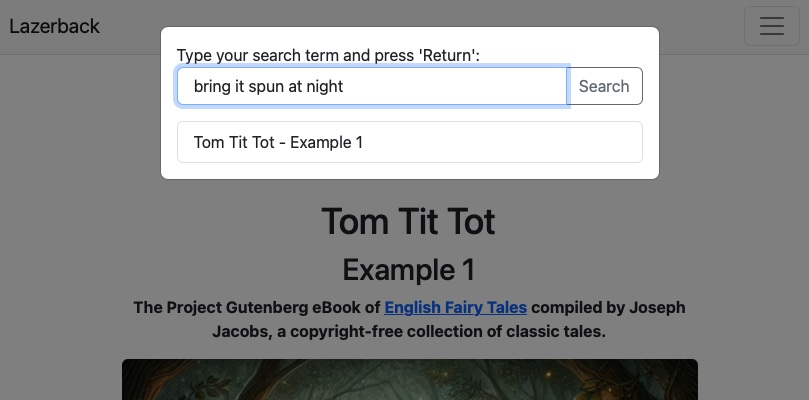

# Lazerback Search
A simple but efficient website search in JavaScript for static websites.


## Running the Script to Create a Search Index
The process begins by creating a search index from the locally stored static website using the Cheerio library. I wrote a Node.js script for this purpose. This is the only part of the project that requires Node.js, as it uses the Cheerio and FS libraries. The script processes a list of local URLs, extracting the title, pathname, and all text within the <main> element. It then cleans up unnecessary line breaks and multiple spaces before appending the processed data to a search index. The resulting search index is saved as a separate JavaScript file, exported as a constant.

Install the project (only needs Cheerio and FS):
```
npm install
```

`index_script.js` can only reliably index locally stored web pages. Edit the file. In the array `pages` you add the paths of the individual static pages, make sure you run `index_script.js` from the root of your website directory so that the paths in the `pages` array match the relative URLs in your website.

Run `index_script.js` with:
```
node index_script.js
```

This will generate the file `site-index.js` in the `js` directory.

## Add search.js to Your Website
`search.js` creates and inserts the search UI into the page, loads the search index and searches for terms entered by a user. Search results list the page titles linked to the pages. When a user clicks on a search result, then they are forwarded to the respective page and their search term is highlighted and the page scrolls to the location of the found search term.

Add `search.js` to your HTML code like so:
```
<script src="js/search.js"></script>
```
Make sure that `site-index.js` is in the same directory as `search.js`.

### Adapt Your UI To Trigger the Search
After adding `search.js` to your HTML, you will need to provide the UI with a trigger for the search. This can be a button, a link or even an input field that calls `onclick="triggerSearch()"`. Only when a user triggers the search, is the site-index loaded and the search UI displayed.

Please note that the search UI uses elements from Bootstrap5. You do not need to use Bootstrap if you don't want to but you'll need to cahnge the modal div.

## Examples
Please see the examples I created to demonstrate how the search functionality works in a practical setup. They use text from the Project Gutenberg eBook of [English Fairy Tales](https://www.gutenberg.org/ebooks/7439) compiled by Joseph Jacobs, a copyright-free collection of classic tales. 

To implement the search, the necessary JavaScript files, including the siteindex.js and the search modal script, are linked in the HTML pages. The UI integrates seamlessly into the website, featuring a Bootstrap-styled modal with an intuitive search field and a results list.



Users can type a query, view a list of matching results, and navigate directly to the relevant content within the selected page, with the searched term highlighted for easy identification.

All title images for the fairy tales are generated using ChatGPT (with text added using Art Text 4).

## More Infos
You can find out more details about how the search works and how I created it here: [marincomics.com/website-search-function.html](https://marincomics.com/website-search-function.html)
